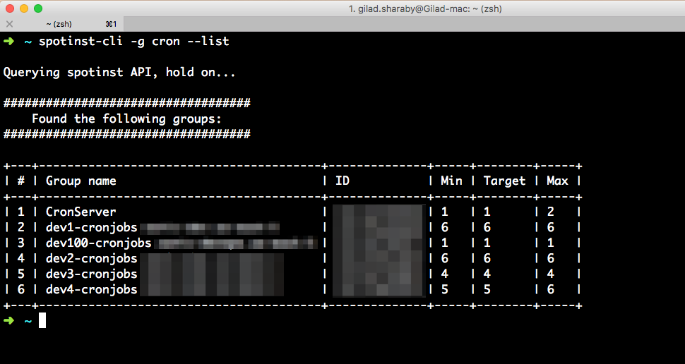
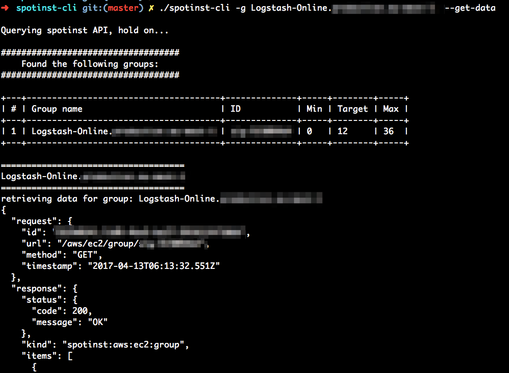
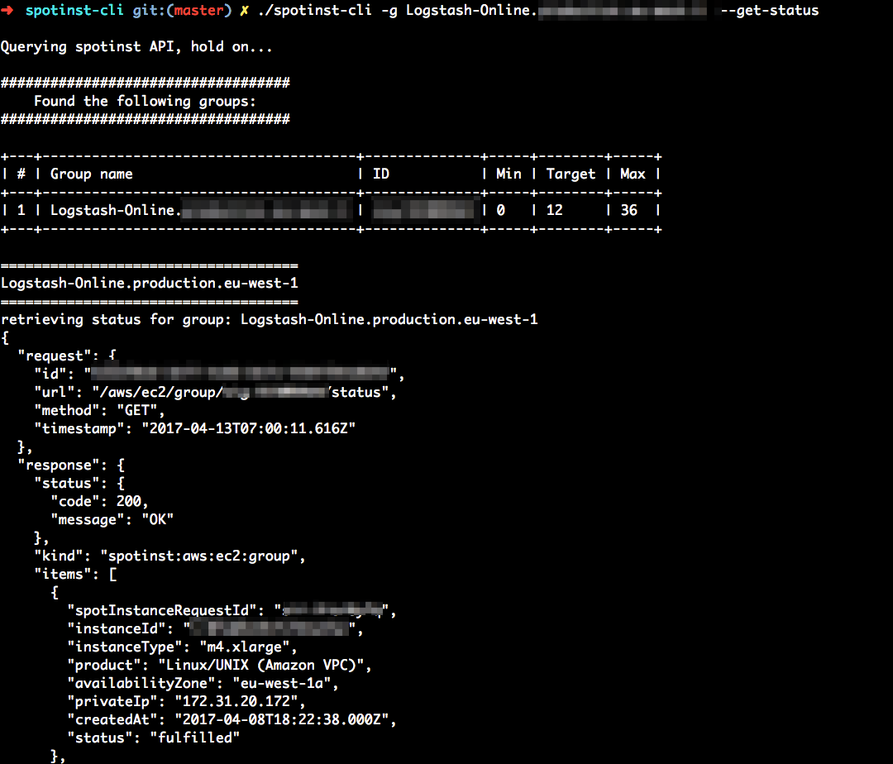
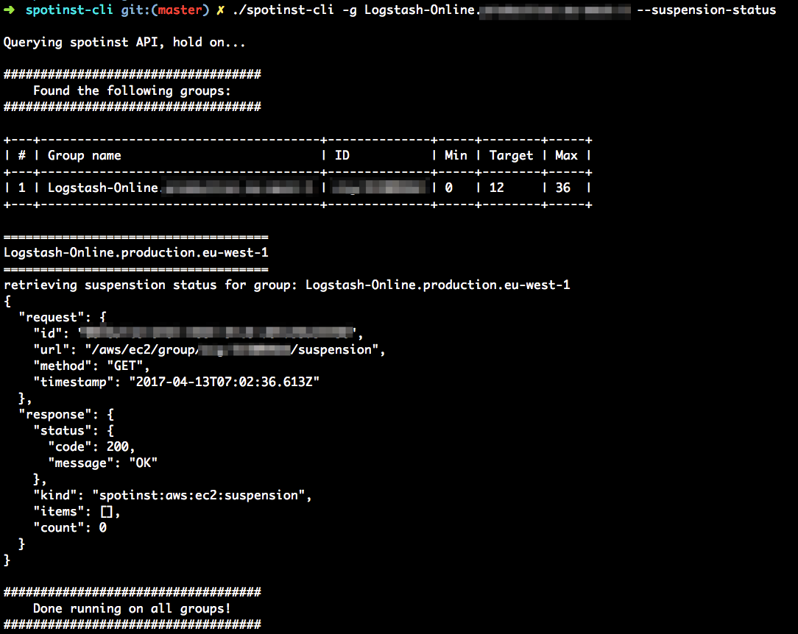
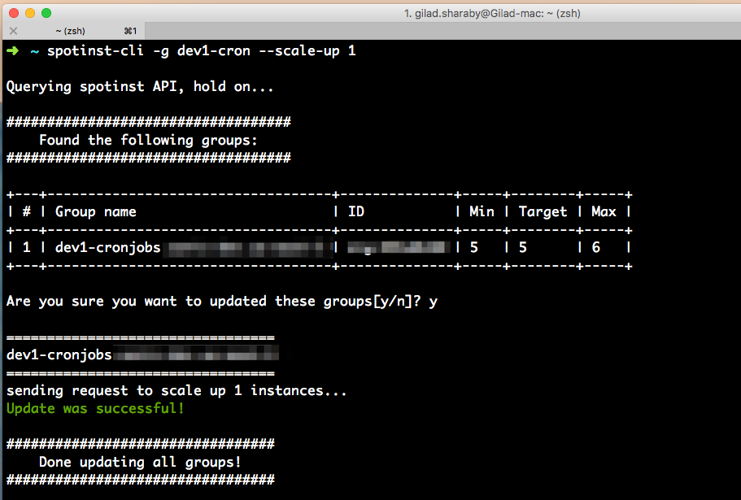
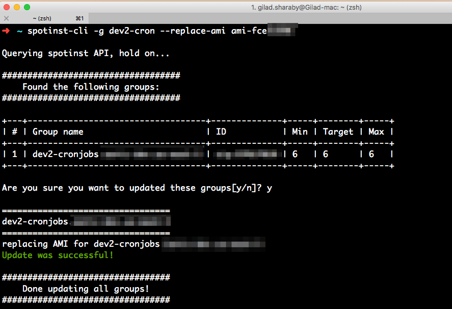
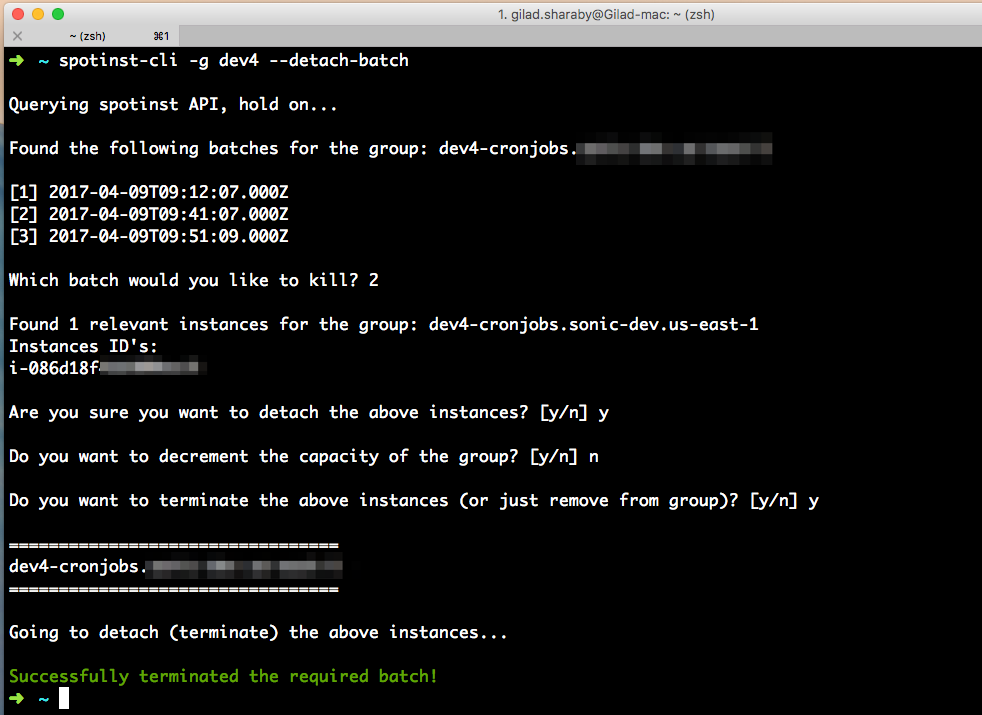

# spotinst-cli
spotinst-cli is is an interactive command line tool which allows you to to control your spotinst groups and instances.

### Usage  

spotinst-cli has the following flags -
```
  -h, --help                   show this help message and exit
  -g GREP, --grep=GREP         text to filter groups by
  -d, --get-data               get groups data from spotinst
  -s, --get-status             get groups status  
  --suspension-status          get groups suspension status  
  -u UNGREP, --ungrep=UNGREP   text to exclude groups
  -l, --list                   show group list and exit
  --min=MIN                    update group minimum capacity, must supply with max and target
  --target=TARGET              update group target capacity, must supply with min and max
  --max=MAX                    update group maximum capacity, must supply with min and target
  --scale-up=SCALE_UP          scale up group by X number of instances
  --scale-down=SCALE_DOWN      scale down group by X number of instances
  --suspend                    suspend group activities
  --unsuspend                  unsuspend group activities
  --roll                       roll a group, must supply batch-size, and grace-period
  --batch-size=BATCH           roll batch size - must supply with the roll flag
  --grace-period=GRACE         roll grace period - must supply with the roll flag
  --replace-ami=AMI            replace AMI for group
  --user-data=USER_DATA        updated user data - supply a file path which contains the user data script (cloud init)
  --detach-batch               detach all instances for specific batch - choose from a list of batches
  -y, --skip-validation        skip prompt validation for non-interactive mode
```

### Example usage
#### list groups with name filter:


#### get groups data:


#### get groups status:


#### get groups suspension status:


#### update group's capacity:


#### scale up:


#### replace group AMI:


#### detach specific batch:

